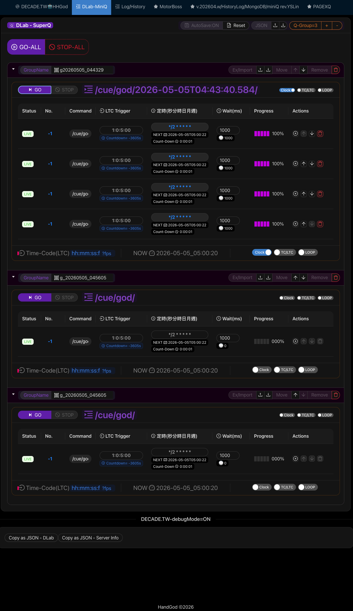

# DECADE.TW_Mini_QLab
QLab is the industry-standard software for multimedia show control (audio, video, lighting) on macOS, now its avaiable on nodejs, this lib only imprelement Network cue and timecode decoder from audio device.

<hr/>

## 💡Update Log
* [adding] | 🟠 Hotkey support
* [added ] | 🟢 ActiveCue side window
* [added ] | 🟢 Group control switch option - loop/cron/clock
* [added ] | 🟢 TimeCode (LTC) support@MAC(WIN not test should be ok)

<hr/>

## 💡Screenshot
### [Main] Cue List

### [add]Active Cue - side window 

### Video Demo Youtube link - Click 
[](https://www.youtube.com/watch?v=PE2jOI2uq9E)

```bash
npm install antd react react-dom 
npm install decade.tw-mini-qlab
```

### TimeCode input init Audio Device
```javascript

initAudioDevice({deviceName: 'aggX1',onFrame:onFrame});

```
```javascript
//use PAGEXQ.jsx to imprelement MiniQ.jsx for Group Cue.

import MiniQ from "./MiniQ.jsx";

const [groupCount, setgroupCount] = useState(2);
const [allAction, setallAction] = useState(''); //send GO|STOP can control all Cue group
return(
    <>
        <Space>
            <Space.Compact block>
                <Button onClick={() => {setallAction('GO')}}>GO-ALL</Button>
                <Button onClick={() => {setallAction('STOP')}}>STOP-ALL</Button>
            </Space.Compact>
        </Space>
        {Array(groupCount).fill(0).map((e, i) => {
            return (<>
                    <Divider>Q-Group{i + 1}</Divider>
                    <MiniQ key={`MiniQ${i}`} group={'g'+i} allAction={allAction}/>
                </>
            )

        })}        
    </>    
    )

```
<hr/>

### Quick Links

* Auto prompt by LLM and LLM-Vision (Trigger more details out inside model)
    * SD-WEB-UI: https://github.com/xlinx/sd-webui-decadetw-auto-prompt-llm
    * ComfyUI:   https://github.com/xlinx/ComfyUI-decadetw-auto-prompt-llm
* Auto msg to ur mobile  (LINE | Telegram | Discord)
    * SD-WEB-UI :https://github.com/xlinx/sd-webui-decadetw-auto-messaging-realtime
    * ComfyUI:  https://github.com/xlinx/ComfyUI-decadetw-auto-messaging-realtime
* I'm SD-VJ. (share SD-generating-process in realtime by gpu)
    * SD-WEB-UI: https://github.com/xlinx/sd-webui-decadetw-spout-syphon-im-vj
    * ComfyUI:   https://github.com/xlinx/ComfyUI-decadetw-spout-syphon-im-vj
* CivitAI Info|discuss:
    * https://civitai.com/articles/6988/extornode-using-llm-trigger-more-detail-that-u-never-thought
    * https://civitai.com/articles/6989/extornode-sd-image-auto-msg-to-u-mobile-realtime
    * https://civitai.com/articles/7090/share-sd-img-to-3rd-software-gpu-share-memory-realtime-spout-or-syphon
