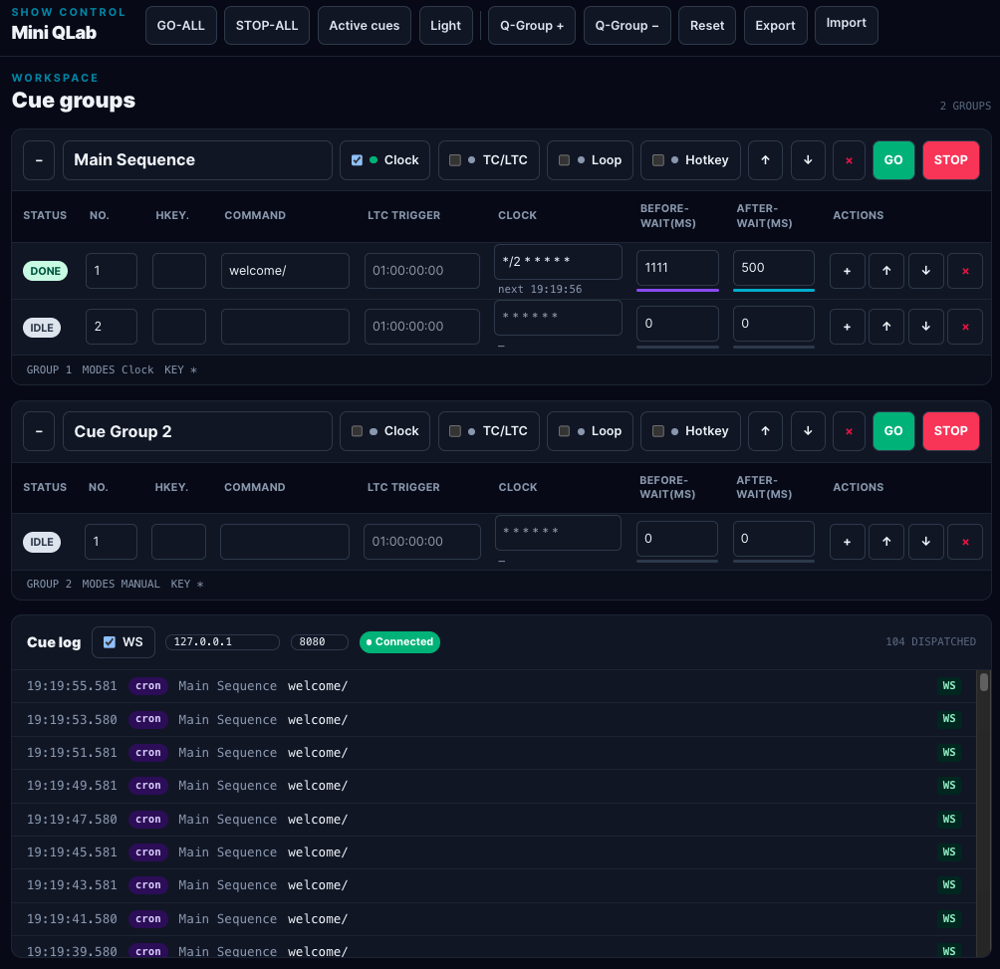
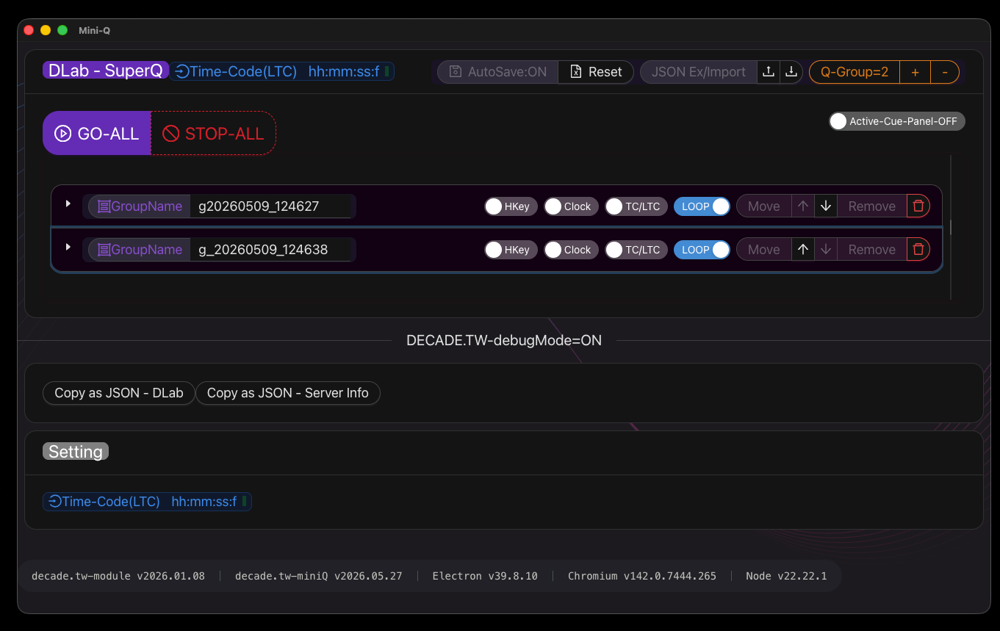
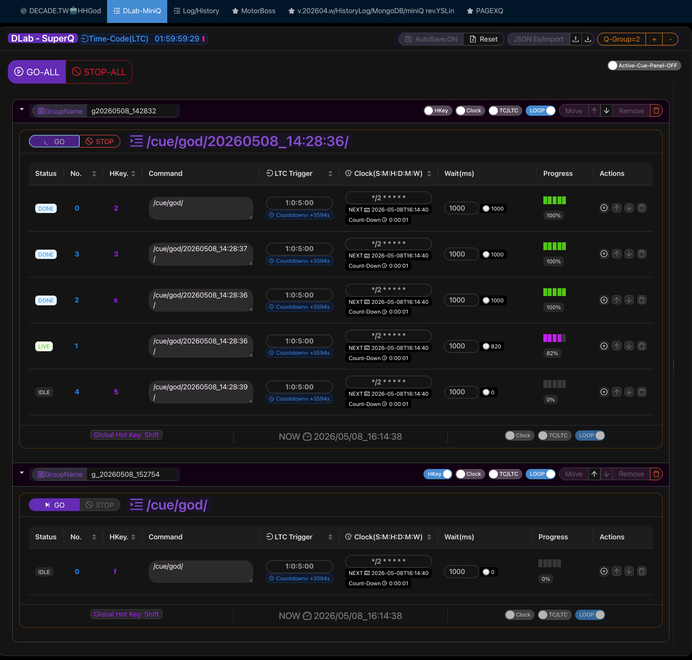
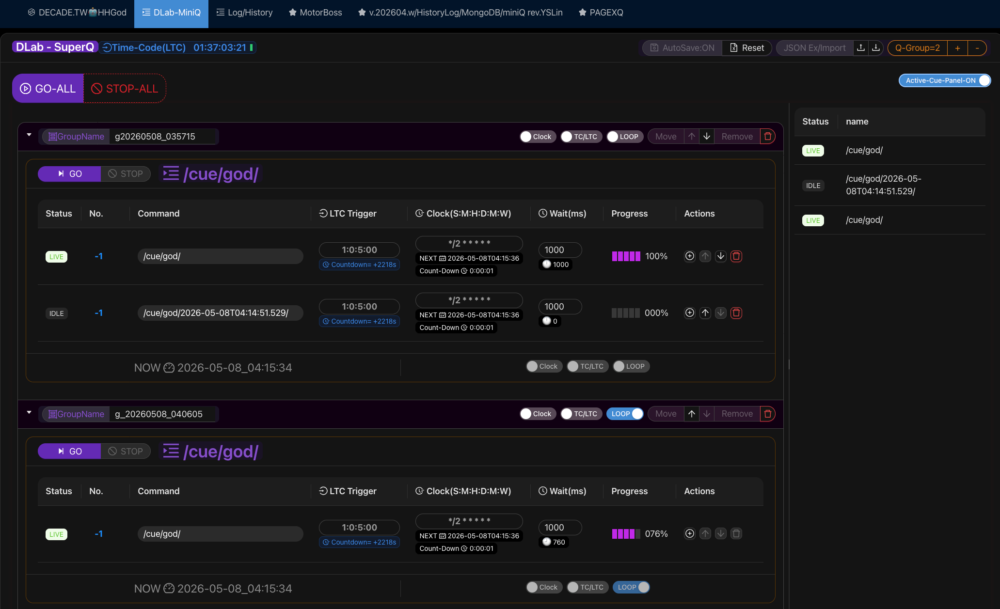
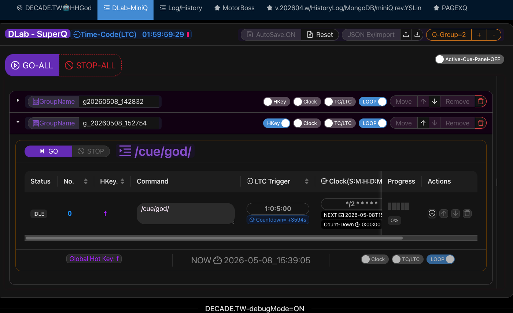
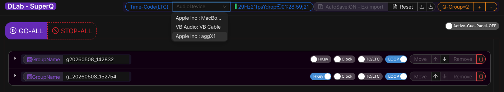

# DECADE.TW-Mini-QLab
QLab is the industry-standard software for multimedia show control (audio, video, lighting) on macOS, now its avaiable on nodejs, this lib only imprelement Network cue and timecode decoder from audio device.
Mini QLab is a responsive React cue-list controller for show-control workflows.
It runs cue groups manually, sequentially, from cron schedules, browser
hotkeys, or externally supplied timecode. Output is delivered through an event
callback so the host application can connect its own OSC, MIDI, WebSocket, or
device transport.

Each Audio cue can select one local MP3 or WAV track and Play, Pause, or Stop
only that track. Its full waveform appears on the timeline. These files are played only on the device: they
are never uploaded or sent through WebSocket, and must be selected again after
a page reload or cue-list import.

- try online: https://www.decade.tw/qlab
- run instantly with npx (zero installation):
  ```bash
  npx mini-qlab
  ```
- with websocket support
    - default ws send to 127.0.0.1 port 8080
- udp/osc u need implement by npm on ur code
<hr/>

## 💡Update Log
* [added] | 🟢 add websocket support
* [modify] | remove antd lib
* [added] | 🟢 standalone Mini-QLab App by Electron
    * mac(arm64|M1-M5/intel)
        * [mini-qlab-1.0.0-arm64.dmg](https://github.com/xlinx/DECADE.TW_Mini_QLab/app-bin)
        * [mini-qlab-1.0.0-intel64.dmg](https://github.com/xlinx/DECADE.TW_Mini_QLab/app-bin)
    * win(arm64/intel64)
        * [mini-qlab.arm64.exe](https://github.com/xlinx/DECADE.TW_Mini_QLab/app-bin)
        * [mini-qlab.intel64.exe](https://github.com/xlinx/DECADE.TW_Mini_QLab/app-bin)
    * linux(snap/AppImage)
        * [mini-qlab.snap](https://github.com/xlinx/DECADE.TW_Mini_QLab/app-bin)
        * [mini-qlab.AppImage](https://github.com/xlinx/DECADE.TW_Mini_QLab/app-bin)
* [adding] | 🟠 Hotkey by USB-HID (No need to focus on window)
* [adding] | 🟠 Hotkey (need focus on window)
* [adding] | 🟠 [TX] TimeCode (LTC)
* [added ] | 🟢 ActiveCue side window
* [added ] | 🟢 Cue trigger control - by cron job
* [added ] | 🟢 Cue trigger control - by world clock
* [added ] | 🟢 Cue trigger control - by loop
* [added ] | 🟢 Cue trigger - by group
* [added ] | 🟢 [RX] TimeCode (LTC) support on MAC (WIN not test should be ok)

<hr/>

## 💡Screenshot
- try online: https://www.decade.tw/qlab
  
### [Main] Mini-Q standalone App (mac/win/linux)

### [Main] Cue List - HotKey/Cron/LTC/Loop

### [add]Active Cue - side window

### [add]HotKey

### [add] LTC - Select Audio Device


### Video Demo Youtube link - Click
[](https://www.youtube.com/watch?v=PE2jOI2uq9E)

### TimeCode input init Audio Device
```javascript

initAudioDevice({deviceName: 'aggX1',onFrame:onFrame});

```

## 🚀 Run Instantly with `npx` (User Manual)

Anyone with [Node.js](https://nodejs.org/) (v18+) installed can run Mini QLab immediately with zero installation:

```bash
npx mini-qlab
```

This single command will:
1. Start a local high-performance web server.
2. Automatically launch your default web browser to `http://localhost:3000`.
3. Display both **Local** and **Network** URLs so other devices (tablets, phones, auxiliary consoles) on the same Wi-Fi or LAN can access the control surface simultaneously.

### CLI Options

| Option | Short | Default | Description |
| :--- | :--- | :--- | :--- |
| `--port <number>` | `-p` | `3000` | Specify server port (automatically retries next open port if taken) |
| `--host <string>` | | `0.0.0.0` | Host to bind (`0.0.0.0` for LAN sharing, `127.0.0.1` for local only) |
| `--no-open` | | `false` | Run server in headless mode without opening the browser |
| `--version` | `-v` | | Print current version |
| `--help` | `-h` | | Print CLI options and usage |

### Examples

```bash
# Default: launches on port 3000 and opens browser
npx mini-qlab

# Specify custom port (e.g. 8080)
npx mini-qlab -p 8080

# Headless mode for remote machines or background services
npx mini-qlab --no-open

# Restrict to localhost only
npx mini-qlab --host 127.0.0.1

# Stop the server:
# Press Ctrl + C
```

<hr/>

## Library usage

```jsx
import MiniQLab from 'mini-qlab';
import 'mini-qlab/styles.css';

export function ShowControl() {
  return (
    <MiniQLab
      rxJson={{ TC: { string: '01:00:00:00' } }}
      onEvent={(event) => {
        if (event.type === 'cue:dispatched') {
          console.log(event.source, event.command);
        }
      }}
    />
  );
}
```

`onEvent` receives sequence lifecycle events and cue dispatches. Dispatch
sources are `sequence`, `cron`, `timecode`, and `hotkey`. `rxJson` is optional;
provide `RX_JSON.TC.string` in that shape to use TC/LTC triggers.

See the bilingual [Mini QLab manual](./docs/mini-qlab.manual.md) for complete
controls, configuration, and limitations.


## Development

Run the automated tests and library build with:

```bash
npm test
npm run build
```


### Quick Links

* Auto prompt by LLM and LLM-Vision (Trigger more details out inside model)
    * SD-WEB-UI: https://github.com/xlinx/sd-webui-decadetw-auto-prompt-llm
    * ComfyUI:   https://github.com/xlinx/ComfyUI-decadetw-auto-prompt-llm
* Auto msg to ur mobile  (LINE | Telegram | Discord)
    * SD-WEB-UI :https://github.com/xlinx/sd-webui-decadetw-auto-messaging-realtime
    * ComfyUI:  https://github.com/xlinx/ComfyUI-decadetw-auto-messaging-realtime
* I'm SD-VJ. (share SD-generating-process in realtime by gpu)
    * SD-WEB-UI: https://github.com/xlinx/sd-webui-decadetw-spout-syphon-im-vj
    * ComfyUI:   https://github.com/xlinx/ComfyUI-decadetw-spout-syphon-im-vj
* CivitAI Info|discuss:
    * https://civitai.com/articles/6988/extornode-using-llm-trigger-more-detail-that-u-never-thought
    * https://civitai.com/articles/6989/extornode-sd-image-auto-msg-to-u-mobile-realtime
    * https://civitai.com/articles/7090/share-sd-img-to-3rd-software-gpu-share-memory-realtime-spout-or-syphon
* DECADE.TW
    * https://decade.tw
