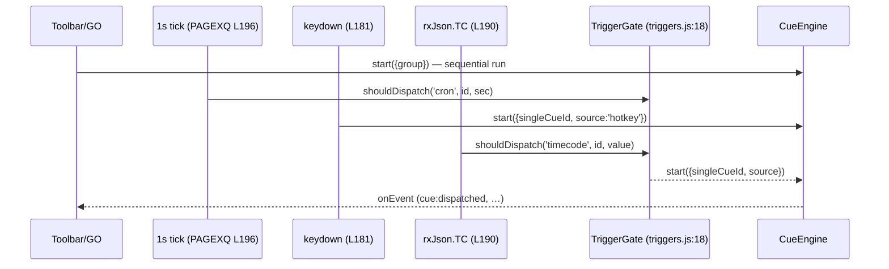

# Mini QLab — Show-Me

React 19 + Vite + Tailwind cue-list controller (`mini-qlab` v2.1.0). Cues fire through a
**pre-wait → trigger → post-wait** pipeline and can be dispatched over a built-in
**WebSocket** transport.

## 1. Big picture

```text
Mini QLab
├── triggers (who fires a cue)
│     manual GO · sequential · cron · hotkey · timecode (TC/LTC)
├── CueEngine (when & how it fires)
│     pre-wait → dispatch (trigger) → post-wait → next cue
└── transports (where it goes)
      onEvent callback (host app: OSC/MIDI/REST…)
      built-in WebSocket client ({command, timestamp})
```

```text
src/
├── PAGEXQ.jsx          # <MiniQLab> — state, WS transport, cue log, trigger wiring
├── main.jsx            # standalone app entry
├── components/
│   ├── Toolbar.jsx     # global GO-ALL/STOP-ALL, theme, groups, import/export
│   ├── CueGroup.jsx    # one group: name, mode checkboxes, GO/STOP, move/remove
│   ├── CueTable.jsx    # cue rows + before/after-wait progress bars
│   └── ActiveCuePanel.jsx  # side panel: cues with status LIVE
└── lib/
    ├── cues.js         # data model + localStorage persistence
    ├── cueEngine.js    # execution engine: waits, phases, advance/stop/loop
    └── triggers.js     # trigger matching (cron/hotkey/TC) + dedupe gate
```

## 2. Cue pipeline (the core)

`CueEngine.runCue` — `src/lib/cueEngine.js:25`

```text
runCue(index)
  if beforeWaitMs > 0                      # PRE-WAIT
    status → LIVE, beforeProgress → 0
    emit cue:started
    tick 100ms → beforeProgress 0…99
    wait() → beforeProgress → 100
  emit cue:dispatched                      # TRIGGER (the actual fire)
  status → DONE
  if afterWaitMs > 0                       # POST-WAIT
    afterProgress → 0…100 (100ms ticks)
    wait()
  advance()
    if single-cue run → done
    else → runCue(next) | loop restart | sequence:completed
```

- Zero-wait path: `cue:started` + `cue:dispatched` fire back-to-back, status straight to DONE.
- `stop()` clears timers, resets cues to IDLE, emits `sequence:stopped` (`cueEngine.js:108`).
- Progress bars: engine pushes `beforeProgress`/`afterProgress` via `onStatus` →
  `CueTable.jsx` renders a 3px violet bar (before) and cyan bar (after); DONE → 100.

## 3. Triggers → engine



- `matchingTriggeredCues` (`triggers.js:26`) — mode must be enabled: group `clockEnabled`
  + cue `cron`; `hotkeyEnabled` + 1-char key; `timecodeEnabled` + exact `ltcTrigger` match.
- `createTriggerGate` dedupes: cron fires once per second, timecode once per distinct value;
  hotkeys are un-gated.
- Cron uses `cron-parser` (`isCronDue`/`nextCronRun`, `triggers.js:3,12`); the table shows the
  next run and an "invalid cron" warning.

## 4. WebSocket transport (all in `src/PAGEXQ.jsx`)

```text
Cue log card (L288-309)
├── WS enable checkbox
├── host / port inputs        # default 8888 (README says 8080 — doc/code mismatch)
├── status pill: connected | connecting | error | off
└── {n} DISPATCHED counter
```

```text
emit(event)                                   # PAGEXQ.jsx:86
  if event.type === 'cue:dispatched'
    entry = { command, timestamp: ISO-8601 }
    persist → localStorage 'TX_JSON_CMD'
    if ws.readyState === OPEN
      socket.send(JSON.stringify(entry))
      entry.ws = 'delivered'                  # per-entry green WS badge
  cueLog.unshift(entry)   # newest first, max 200
  onEvent(event)          # always, last
```

- Connection effect (L138-176): tears down on config change; `ws://host:port`;
  config persisted to `localStorage['mini-qlab-ws']`.
- Log row: `HH:MM:SS.mmm` · source badge (sequence/cron/timecode/hotkey) · group · command · WS badge.

## 5. onEvent contract (host app)

```js
{
  type: 'sequence:started' | 'sequence:completed' | 'sequence:stopped'
      | 'cue:started'      | 'cue:dispatched',
  timestamp: '<ISO 8601>',
  group: { index, name },
  cue?: { /* full cue object, on cue:* events */ },
  // cue:dispatched only:
  command?: 'lights/',
  source?: 'sequence' | 'cron' | 'timecode' | 'hotkey',
}
```

## 6. Component tree

```tsx
<MiniQLab> (src/PAGEXQ.jsx:54)  props: onEvent, rxJson, initialGroups
  <Toolbar>               # GO-ALL/STOP-ALL, theme, panel toggle, groups, import/export
  {groups.map →}
    <CueGroup>            # name, Clock/TC-LTC/Loop/Hotkey checkboxes, GO/STOP, move/remove
      <CueTable>          # Status · No · HKey · Command · LTC · Cron · Before-wait▓ · After-wait▓ · ±
  <ActiveCuePanel>        # LIVE cues (reads cue.progress — field doesn't exist, % always undefined)
  <section "Cue log">     # inline, not a component: WS config + dispatched entries
```

## 7. Tests (`npm test`, vitest)

```text
tests/
├── cueEngine.test.js   # wait order, stop, loop, single-cue+source, LIVE/progress (fake timers)
├── cues.test.js        # normalizeCommand, hydration, persistence round-trips
├── triggers.test.js    # gate dedupe, cron validity, mode gating, nextCronRun
├── PAGEXQ.test.jsx     # integration: dispatch via onEvent, TC once-per-value, cue log, WS mock
├── smoke.test.jsx      # toolbar renders
└── package.test.js     # dist entry points exist
```

## 8. Uncommitted WIP

```diff
 package.json
-  "version": "0.1.0"
+  "version": "2.1.0"
-  react ^18.2.0 / vite ^5 / vitest ^2
+  react ^19 / vite ^8 / vitest ^5 (+ @vitejs/plugin-react ^6)

 src/PAGEXQ.jsx
-  theme default 'light'
+  theme default 'dark'

 src/components/Toolbar.jsx
-  <p>Show control</p><h1>Mini QLab</h1>
+  
+  <p>DECADE.TW</p><h1>Mini QLab</h1>

 README.md  (+106/-6)  # rewritten: update log, screenshots, demo links, library usage
                        # ⚠ section 7 duplicates "Library usage" verbatim (leftover)
                        # ⚠ says default WS port 8080, code default is 8888

 ?? qlab/               # assets + index.html (standalone build?)
 ?? function.eng.md / function.tw.md   # 371-line feature references (EN/TW)
```
