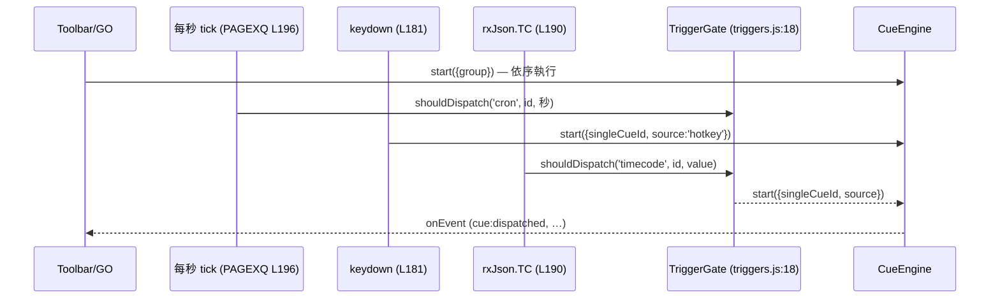

# Mini QLab — 視覺導覽（繁體中文）

React 19 + Vite + Tailwind 的 cue 列表控制器（`mini-qlab` v2.1.0）。
每個 cue 依 **pre-wait → trigger → post-wait** 流程執行，並可透過內建的
**WebSocket** 外送。

## 1. 總覽

```text
Mini QLab
├── triggers（誰觸發 cue）
│     手動 GO · 依序執行 · cron 排程 · 熱鍵 · 時間碼（TC/LTC）
├── CueEngine（何時、如何觸發）
│     pre-wait → dispatch（trigger）→ post-wait → 下一個 cue
└── transports（送往哪裡）
      onEvent 回呼（宿主應用：OSC/MIDI/REST…）
      內建 WebSocket client（{command, timestamp}）
```

```text
src/
├── PAGEXQ.jsx          # <MiniQLab> — 狀態、WS transport、cue log、trigger 接線
├── main.jsx            # 獨立應用入口
├── components/
│   ├── Toolbar.jsx     # 全域 GO-ALL/STOP-ALL、主題、群組、匯入/匯出
│   ├── CueGroup.jsx    # 單一群組：名稱、模式勾選、GO/STOP、移動/刪除
│   ├── CueTable.jsx    # cue 列 + before/after-wait 進度條
│   └── ActiveCuePanel.jsx  # 側欄：status 為 LIVE 的 cue
└── lib/
    ├── cues.js         # 資料模型 + localStorage 持久化
    ├── cueEngine.js    # 執行引擎：等待、階段、advance/stop/loop
    └── triggers.js     # trigger 比對（cron/熱鍵/TC）+ 去重閘門
```

## 2. Cue 執行流程（核心）

`CueEngine.runCue` — `src/lib/cueEngine.js:25`

```text
runCue(index)
  if beforeWaitMs > 0                      # PRE-WAIT（觸發前等待）
    status → LIVE，beforeProgress → 0
    emit cue:started
    每 100ms tick → beforeProgress 0…99
    wait() → beforeProgress → 100
  emit cue:dispatched                      # TRIGGER（實際觸發）
  status → DONE
  if afterWaitMs > 0                       # POST-WAIT（觸發後等待）
    afterProgress → 0…100（每 100ms tick）
    wait()
  advance()
    若是單 cue 執行 → 結束
    否則 → runCue(下一個) | 循環重啟 | sequence:completed
```

- 零等待路徑：`cue:started` + `cue:dispatched` 連續發出，status 直接轉 DONE。
- `stop()` 清除 timer、把 cue 重設為 IDLE、發出 `sequence:stopped`（`cueEngine.js:108`）。
- 進度條：engine 透過 `onStatus` 推送 `beforeProgress`/`afterProgress` →
  `CueTable.jsx` 渲染 3px 紫色條（before）與青色條（after）；DONE → 100。

## 3. Triggers → engine



- `matchingTriggeredCues`（`triggers.js:26`）— 模式必須開啟：群組 `clockEnabled`
  + cue `cron`；`hotkeyEnabled` + 1 字元熱鍵；`timecodeEnabled` + `ltcTrigger` 完全相符。
- `createTriggerGate` 去重：cron 每秒只觸發一次、timecode 同一值只觸發一次；
  熱鍵不去重。
- Cron 使用 `cron-parser`（`isCronDue`/`nextCronRun`，`triggers.js:3,12`）；
  表格會顯示下次執行時間與「invalid cron」警告。

## 4. WebSocket transport（全在 `src/PAGEXQ.jsx`）

```text
Cue log 卡片（L288-309）
├── WS 啟用勾選框
├── host / port 輸入欄        # 預設 8888（README 寫 8080 — 文件與程式不一致）
├── 狀態徽章：connected | connecting | error | off
└── {n} DISPATCHED 計數
```

```text
emit(event)                                   # PAGEXQ.jsx:86
  if event.type === 'cue:dispatched'
    entry = { command, timestamp: ISO-8601 }
    持久化 → localStorage 'TX_JSON_CMD'
    if ws.readyState === OPEN
      socket.send(JSON.stringify(entry))
      entry.ws = 'delivered'                  # 每筆綠色 WS 徽章
  cueLog.unshift(entry)   # 最新在前，最多 200 筆
  onEvent(event)          # 一律最後呼叫
```

- 連線 effect（L138-176）：設定變更時關閉舊連線；`ws://host:port`；
  設定存於 `localStorage['mini-qlab-ws']`。
- Log 列：`HH:MM:SS.mmm` · 來源徽章（sequence/cron/timecode/hotkey）· 群組 · command · WS 徽章。

## 5. onEvent 契約（宿主應用）

```js
{
  type: 'sequence:started' | 'sequence:completed' | 'sequence:stopped'
      | 'cue:started'      | 'cue:dispatched',
  timestamp: '<ISO 8601>',
  group: { index, name },
  cue?: { /* 完整 cue 物件，僅 cue:* 事件 */ },
  // 僅 cue:dispatched：
  command?: 'lights/',
  source?: 'sequence' | 'cron' | 'timecode' | 'hotkey',
}
```

## 6. 元件樹

```tsx
<MiniQLab> (src/PAGEXQ.jsx:54)  props: onEvent, rxJson, initialGroups
  <Toolbar>               # GO-ALL/STOP-ALL、主題、側欄切換、群組、匯入/匯出
  {groups.map →}
    <CueGroup>            # 名稱、Clock/TC-LTC/Loop/Hotkey 勾選、GO/STOP、移動/刪除
      <CueTable>          # Status · No · HKey · Command · LTC · Cron · Before-wait▓ · After-wait▓ · ±
  <ActiveCuePanel>        # LIVE cue（讀取 cue.progress — 欄位不存在，% 永遠 undefined）
  <section "Cue log">     # 內嵌於 PAGEXQ，非獨立元件：WS 設定 + 已派送清單
```

## 7. 測試（`npm test`，vitest）

```text
tests/
├── cueEngine.test.js   # 等待順序、stop、loop、單 cue+source、LIVE/進度（fake timers）
├── cues.test.js        # normalizeCommand、hydration、持久化往返
├── triggers.test.js    # 閘門去重、cron 有效性、模式閘控、nextCronRun
├── PAGEXQ.test.jsx     # 整合測試：onEvent 派送、TC 同值一次、cue log、WS mock
├── smoke.test.jsx      # toolbar 渲染
└── package.test.js     # dist 入口存在
```

## 8. 未提交的變更

```diff
 package.json
-  "version": "0.1.0"
+  "version": "2.1.0"
-  react ^18.2.0 / vite ^5 / vitest ^2
+  react ^19 / vite ^8 / vitest ^5（+ @vitejs/plugin-react ^6）

 src/PAGEXQ.jsx
-  主題預設 'light'
+  主題預設 'dark'

 src/components/Toolbar.jsx
-  <p>Show control</p><h1>Mini QLab</h1>
+  
+  <p>DECADE.TW</p><h1>Mini QLab</h1>

 README.md  (+106/-6)  # 重寫：更新日誌、截圖、demo 連結、library 用法
                        # ⚠ 第 7 節重複了「Library usage」（整段重複，疑似殘留）
                        # ⚠ 寫預設 WS port 8080，程式預設是 8888

 ?? qlab/               # assets + index.html（獨立建置產物？）
 ?? function.eng.md / function.tw.md   # 371 行功能參考（英/繁中）
```
